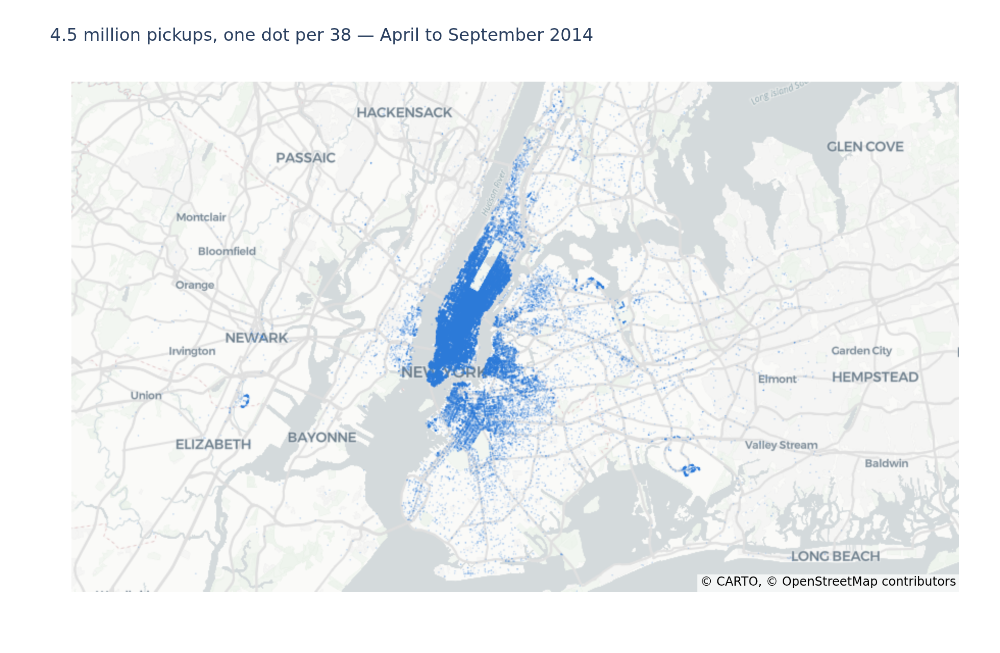
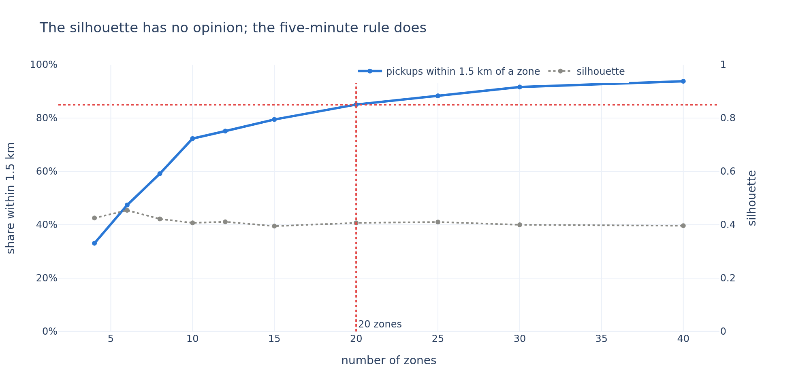
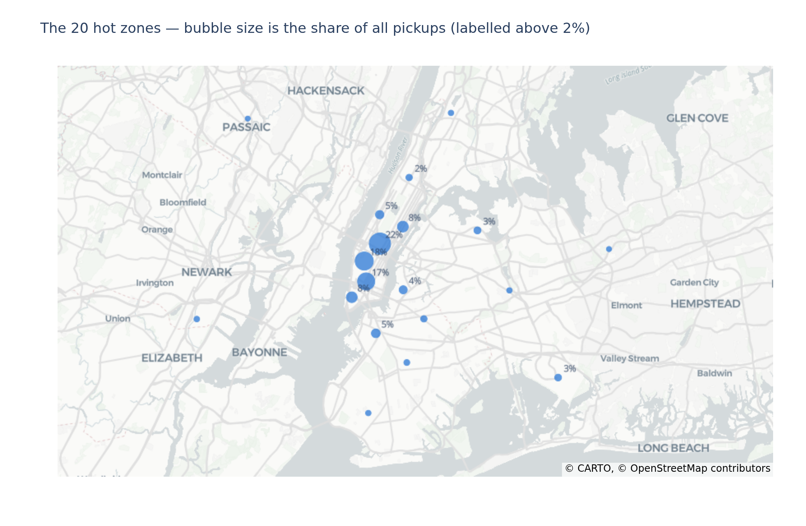
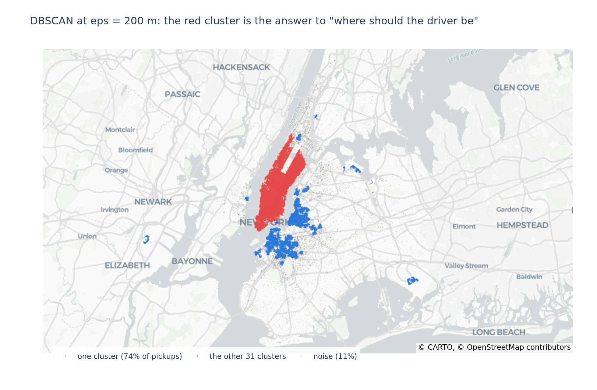
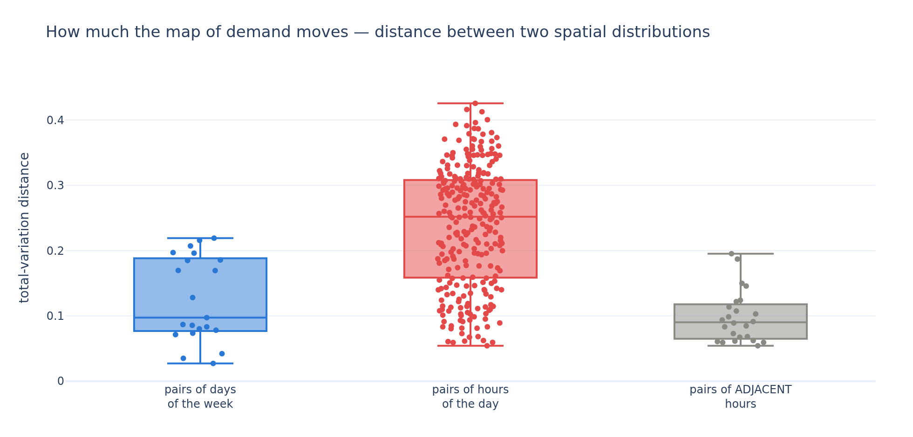
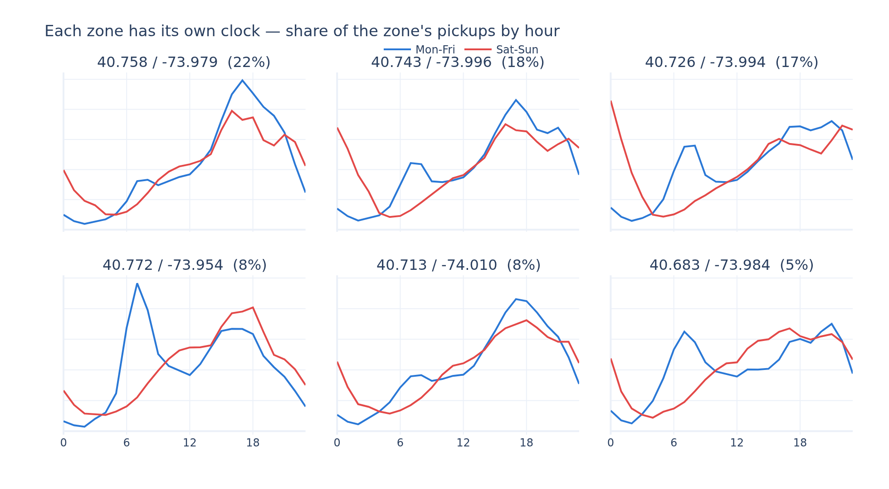

# Where should the drivers be?

A clustering study of **4.5 million New York pickups**, run for a product team that wants the Uber
app to recommend hot zones to drivers at any given time of day.

Jedha *Full Stack Data Scientist* — **Block 3, Machine Learning Project** (Uber Pickups).
scikit-learn, plotly.

The full analysis, with every parameter choice and its measured cost, is in
[`uber_project.ipynb`](uber_project.ipynb).

## The problem

Uber's own research gives the constraint the whole project hangs on: **a rider accepts a wait of 5
to 7 minutes and cancels beyond it.** A driver in the Castro is useless to a rider in the Financial
District. The brief asks for a map of hot zones, a description **per day of week**, and a
comparison of **two unsupervised algorithms**.

All three are below. Two of the three answers are not the expected ones:

> **The day of week is the weak axis.** The map of demand moves twice as much between two hours of
> the same day (0.238) as between two days of the week (0.125). Two *adjacent* hours move it almost
> as much as an average pair of days.
>
> **DBSCAN cannot answer this question, and the reason is interesting.** It looks for zones
> separated by empty space; Manhattan has none. At every one of twelve parameter settings it
> returns one cluster holding three quarters of the city, or throws away a third of the demand as
> noise.

## The dataset

`data/uber-trip-data/uber-raw-data-*14.csv` — **4 534 327 pickups**, April to September 2014, four
columns: a minute, a latitude, a longitude, and the Uber base that dispatched the ride. No
drop-off, no rider, no fare, no duration. It is a stream of points in space and time, which is what
a clustering question needs and nothing more.

The archive also ships six more months as `uber-raw-data-janjune-15.csv.zip`. **It is not used, and
not by preference:** that file has no coordinates. It identifies a pickup by `locationID`, a
taxi-zone index — the answer to "where should the driver be" already pre-aggregated into somebody
else's 265 zones, which is the very thing this project has to build.

Two things in the file look like they need a cleaning rule. Only one of them does:

| | verdict | cost of the rule |
|---|---|---|
| **82 581 duplicated rows** | **kept** | they would be 1.8% of the demand, deleted |
| **21 227 pickups outside New York** | **dropped** | 0.47% of pickups, over 151 cells of 10 km, median 26 each |

The duplicates are two riders, not one pickup counted twice: a row is duplicated when two pickups
share a minute, a base **and** an 11-metre square, and with a median of 16 pickups a minute over
260 000 minutes that is arithmetic. The shape agrees — 82 225 of the 82 403 groups are *pairs*, not
long runs — and so does the rate: **1.96% within 1.5 km of an airport against 1.81% everywhere
else**, the same rate at the two extremes of density. A broken export would cluster somewhere.

## What we found

### The demand is one continuous ramp, not a set of neighbourhoods



**53 squares of 500 metres hold half of the 4.5 million pickups**, and 146 hold 80%, out of 6 927
squares that see any pickup at all. That concentration is smooth: it has no *gaps* in it, which is
the fact that decides the algorithm comparison below.

### The five-minute rule picks the number of zones; the silhouette cannot



The silhouette is flat between **0.40 and 0.45** across k = 4 to 40 — it peaks at 6 zones, which
would leave a rider a median of 1.6 km from the nearest driver. It is measuring compactness in a
cloud with no natural seams, and it should not be allowed to choose.

The brief's own constraint does choose. Five to seven minutes in city traffic is roughly 1.5 km:

| zones | median distance | within 1.5 km | silhouette |
|---|---|---|---|
| 6 | 1 555 m | 47% | 0.454 |
| 12 | 1 058 m | 75% | 0.411 |
| **20** | **874 m** | **85%** | 0.407 |
| 30 | 639 m | 92% | 0.400 |

**k = 20.** Thirty zones would reach 92%, but a driver-facing app listing thirty destinations for
one city is a directory, not a recommendation.



Four zones between the Financial District and Midtown carry **64% of the demand**, led by Midtown
at 22.0%; with the Upper East and Upper West sides, six zones of Manhattan hold **77%**. The rest
is the city's other business: Downtown Brooklyn, Williamsburg, **LaGuardia** (2.8%), **JFK** (2.5%),
Harlem, **Newark** (0.9%).

**One caveat that has to be said out loud.** Re-fitting the same k = 20 with another seed reassigns
**13 to 17% of pickups** and moves one centre by more than **5 km**, for less than 2% of inertia.
KMeans on a smooth density has many near-equal optima and the seed picks between them. The
consequence is operational: fit the zones once, freeze them, and version them.

### DBSCAN answers correctly that there is no empty space between Midtown and the East Village



Twelve parameter settings, and **the biggest cluster never drops below 49% of the sample.** Loosen
`eps` and Manhattan, Brooklyn and Queens fuse into a single 93% blob; tighten it until the blob
finally breaks apart, and DBSCAN discards **38% of the demand as noise**. The result is stable
across sample sizes from 50 000 to 400 000 pickups, so it is not an artefact of either.

What DBSCAN *does* isolate is exactly what is separated by water, runway or park: Williamsburg
across the East River, Downtown Brooklyn, JFK, LaGuardia, Newark. **It found the three airports on
its own, without being told there were three** — which no KMeans run can claim.

| | KMeans | DBSCAN |
|---|---|---|
| answers | where do I send N drivers | which places are dense |
| number of zones | chosen — by the 5-minute rule | emerges — 30 to 35, unusable as a list |
| Manhattan | split into 6 usable zones | one cluster, 74% of the city |
| airports | found, as 3 of the 20 zones | found, as separate clusters |
| the quiet half of the city | assigned to its nearest zone | 11% to 38% discarded as noise |
| stability | seed-dependent | stable across sample sizes |

**KMeans is the right tool here** — not because it scores better on a clustering metric, but
because the question is a placement problem with a budget of drivers, and that is what it solves.

### The day of week is the wrong axis for the feature



Measuring the total-variation distance between the city's 500 m-cell distributions, for every pair
of days and every pair of hours:

| | mean | worst |
|---|---|---|
| two days of the week | 0.125 | 0.219 |
| **two hours of the day** | **0.238** | **0.426** |
| two *adjacent* hours | 0.098 | — |

**The hour moves the map twice as much as the day of week**, and two adjacent hours move it almost
as much as an average pair of days: 4h and 5h are three times as far apart (0.146) as a Tuesday and
a Thursday (0.042).

The day still matters, through the *shape* it gives the clock rather than through geography.
Monday to Friday the demand is a commute — a bump at 7-8h, a peak at 17-18h. Saturday and Sunday it
is a night out: **the first three hours of Sunday carry 14.5% of the day against 2.4% on a Monday.**



And each zone has its own clock. The deliverable is indexed by *(zone, hour, weekday-or-weekend)*.

## What Uber should ship

1. **Twenty zones, refreshed hourly, is the product.** 20 centres put 85% of pickups within 1.5 km
   — the 5-to-7-minute wait the brief starts from.
2. **Index the recommendation by the hour first, weekday-versus-weekend second.** A feature that
   recommends "Thursday's zones" is indexing on the weaker variable.
3. **Freeze the zone map and version it.** The zones are one of many near-equal answers, so the one
   that ships has to be pinned, not recomputed nightly.
4. **Treat the airports separately.** JFK, LaGuardia and Newark are the only three zones a density
   algorithm finds unaided, they carry 6.2% of pickups, and their clock is a flight schedule.
5. **What the file cannot answer.** There is no drop-off, so nothing here knows where a driver
   *ends up* — a zone that is easy to leave is worth more than one that strands the driver. There
   is no rider wait either: 1.5 km is a proxy for five minutes, and the real number is in Uber's
   own dispatch logs. Both are cheap to log and would turn a placement map into a supply plan.

## Reproducing

The pickups are not redistributed in this repository — 280 MB extracted, over GitHub's file-size
limit. Two commands fetch them:

```bash
mkdir -p data && curl -o data/uber-trip-data.zip \
  "https://full-stack-bigdata-datasets.s3.eu-west-3.amazonaws.com/Machine+Learning+non+Supervis%C3%A9/Projects/uber-trip-data.zip"
unzip -o data/uber-trip-data.zip -d data/
```

Then:

```bash
python3 -m venv .venv
.venv/bin/pip install -r requirements.txt
```

Open `uber_project.ipynb` and select the `.venv` kernel.

Charts render as static images so the notebook stays readable on GitHub, which strips interactive
plotly output; the same PNGs are written to `images/`. If `kaleido` cannot find a browser, run
`.venv/bin/plotly_get_chrome`. **The maps need a network connection at render time** — the basemap
tiles come from CARTO.

Everything is seeded on `RANDOM_STATE = 42`, so a re-run reproduces every number above. The whole
notebook executes in about **10 minutes**, almost all of it in the KMeans sweep over ten values of
k and the twelve DBSCAN fits.

## Layout

```
uber_project.ipynb          the analysis — sections 1 to 7
data/uber-trip-data/        the pickups, 6 monthly CSVs (downloaded, see above)
images/                     the seven figures, also embedded in the notebook
requirements.txt            pinned versions
```
