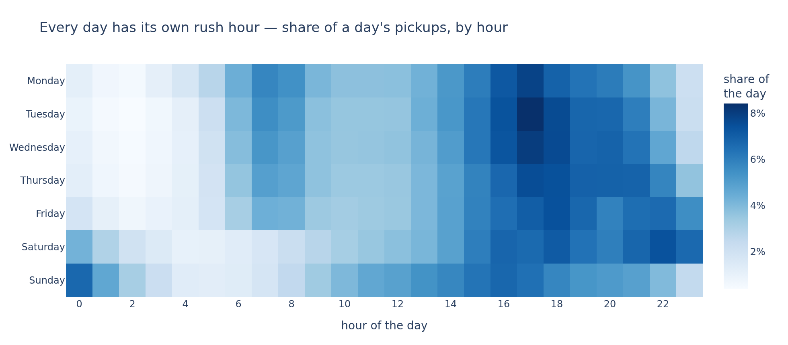

# Where should the drivers be?

A clustering study of **4.4 million New York pickups**, run for a product team that wants the Uber
app to recommend hot zones to drivers at any given time of day.

Jedha *Full Stack Data Scientist* — **Block 3, Machine Learning Project** (Uber Pickups).
scikit-learn, plotly, shapely.

The full analysis, with every parameter choice and its measured cost, is in
[`uber_project.ipynb`](uber_project.ipynb).

## The problem

Uber's own research gives the constraint the whole project hangs on: **a rider accepts a wait of 5
to 7 minutes and cancels beyond it.** The brief asks for a map of hot zones, a description **per day
of week**, and a comparison of **two unsupervised algorithms**.

All three are below. Two of the three answers are not the expected ones:

> **DBSCAN cannot answer this question, and the reason is interesting.** It looks for zones
> separated by empty space; New York's demand has none. Over twelve parameter settings it returns
> either one cluster holding three quarters of the city, or a list bought by discarding up to 37%
> of the demand as noise.
>
> **The standard clustering metric picks the wrong number of zones.** The silhouette is highest at
> `k = 6` — a cut that leaves 46.1% of riders further than six minutes from their zone centre. The
> number that ships comes from the wait the brief gives, not from the metric.

## The dataset

`data/uber-trip-data/uber-raw-data-*14.csv` — **4 534 327 pickups**, April to September 2014, four
columns: a minute, a latitude, a longitude, and the Uber base that dispatched the ride. No
drop-off, no rider, no fare, no duration. It is a stream of points in space and time.

The archive also ships six more months as `uber-raw-data-janjune-15.csv.zip`. **It is not used, and
not by preference:** that file has no coordinates. It identifies a pickup by `locationID`, a
taxi-zone index — the answer to "where should the driver be" already pre-aggregated into somebody
else's 265 zones, which is the very thing this project has to build.

Two things in the file look like they need a cleaning rule. Only one of them does:

| | verdict | cost of the rule |
|---|---|---|
| **82 581 duplicated rows** | **kept** | they would be 1.82% of the demand, deleted |
| **122 454 pickups outside New York City** | **dropped** | 2.70% of pickups, reaching latitude 42.12 |

The duplicates are two riders, not one pickup counted twice: a row is duplicated when two pickups
share a minute, a position **and** a base, and with a median of 16 pickups a minute over 260 093
minutes, the 82 581 duplicated rows form **82 225 pairs, 178 triples, and nothing larger**.

The second rule is the city's own boundary rather than a rectangle drawn by hand: the five boroughs
as the Department of City Planning publishes them (`data/nyc_boroughs.geojson`), tested point in
polygon. **4 411 873 pickups** are kept, and every section below runs on them.

## What we found

### Three quarters of the demand is Manhattan


| borough | pickups | share |
|---|---|---|
| **Manhattan** | 3 443 435 | **75.94%** |
| Brooklyn | 593 610 | 13.09% |
| Queens | 342 208 | 7.55% |
| Bronx | 31 586 | 0.70% |
| Staten Island | 1 034 | 0.02% |

The concentration continues inside the boroughs. The busiest 500 m square of Manhattan sees **2 018
pickups in a single hour** against a median of 48 for a Manhattan square — 42 times more. In Queens
that ratio is 94, in Staten Island it is 2.

### Every day has its own clock



| day | peak hour | share of its own day | share of the week |
|---|---|---|---|
| Mon | 17h | 7.8% | 11.9% |
| Tue | 17h | **8.4%** | 14.7% |
| Wed | 17h | 8.0% | 15.4% |
| Thu | 17h | 7.5% | **16.7%** |
| Fri | 18h | 7.4% | 16.4% |
| Sat | 22h | 7.4% | 14.2% |
| Sun | 16h | 6.7% | 10.7% |

Monday to Friday the demand is a commute: a band when offices fill, a pale middle of the day, a
wider band when they empty. Saturday and Sunday run on another clock — the morning band disappears
and the colour moves to the two edges of the row. The sharpest peak of the week is Tuesday's, which
holds 8.4% of its day; the busiest day is Thursday, at 16.7% of the week. They are not the same day.

### The wait picks the number of zones; the silhouette cannot


The brief gives a duration and the file holds nothing to convert it with — no duration column, no
destination. The speed is therefore an external input, cited rather than assumed: **15.7 km/h**,
TomTom's traffic index for New York. Five, six and seven minutes buy 1.31, 1.57 and 1.83 km, and
every cut is priced at all three rather than at one.

| zones | median distance | 5 min | 6 min | 7 min | silhouette |
|---|---|---|---|---|---|
| 6 | 1 477 m | 56.9% | 46.1% | 36.1% | **0.473** |
| 15 | 872 m | 20.3% | 13.1% | 9.2% | 0.405 |
| 20 | 770 m | 15.3% | 8.9% | 5.8% | 0.401 |
| **25** | **674 m** | **9.7%** | **6.2%** | **4.3%** | 0.406 |
| 40 | 519 m | 5.4% | 3.6% | 2.4% | 0.381 |

**k = 25** is the smallest cut that keeps cancellations under one ride in ten even at the strictest
reading of the brief, five minutes. The silhouette stays between 0.381 and 0.473 over the whole
grid and peaks at `k = 6`: it scores the shape of the partition and carries no term for the wait,
the rider or the cancelled ride, so it is printed here and not acted on.


The 25 zones run from **12.51%** of the demand down to **0.23%**, a factor of 53; the five biggest
carry 51.6%, the thirteen smallest 14.9% between them. Their busiest hours spread over seven
distinct values, from 7h to 22h — there is no one city-wide list of hot zones valid all day. Two
zones sit on the airports: **zone 10 on LaGuardia** (2.57%, busiest at 20h) and **zone 11 on JFK**
(2.52%, busiest at 14h), when every weekday in the city peaks at 17h or 18h.

### DBSCAN answers correctly that there is no empty space to cut along


| setting | clusters | noise | biggest cluster |
|---|---|---|---|
| loosest — `eps` 500 m, `min_samples` 20 | 15 | 1.83% | **94.84%** |
| reference — `eps` 200 m, `min_samples` 50 | 26 | 9.81% | 75.82% |
| tightest — `eps` 100 m, `min_samples` 100 | 43 | **36.76%** | 50.60% |

Twelve settings, and **the biggest cluster never drops below 51% of the sample.** Loosen `eps` and
the city fuses into a single 95% blob; tighten it until the blob finally breaks apart, and DBSCAN
is throwing away 37% of the demand as noise. It is not a sampling artefact either: from 50 000 to
400 000 pickups at constant density, the biggest cluster stays between 75.67% and 76.14%.

What DBSCAN *does* isolate is exactly what water and runways already separate: the far bank of the
East River, and the two airports, marked on the panels. KMeans puts a centre on each of those too,
but only because it was told to place twenty-five centres somewhere.

| | KMeans | DBSCAN |
|---|---|---|
| answers | where do I send N drivers | which places are dense |
| number of zones | chosen — by the wait | emerges — 9 to 111, unusable as a list |
| the dense core | split into usable zones | one cluster, three quarters of the city |
| airports | found, as 2 of the 25 zones | found, outside the main cluster |
| the quiet half of the city | assigned to its nearest zone | 2% to 37% discarded as noise |

**KMeans is the right tool here** — not because it scores better on a clustering metric, but
because the question is a placement problem with a budget of drivers, and that is what it solves.
DBSCAN's contribution is the proof that the demand is one continuous mass, which is what makes any
"natural zone" claim false.

## What Uber should ship

1. **Ship KMeans, and ship twenty-five zones.** At `k = 25`, 9.7% of rides leave the rider further
   from their zone centre than five minutes of driving and 4.3% further than seven: across the
   whole 5-to-7-minute window, fewer than one rider in ten is out of reach. Twenty zones would push
   the five-minute figure to 15.3%.
2. **Index the recommendation on the hour, and let the day reshape the clock.** The peak moves from
   16h to 22h depending on the day, and the 25 zones peak over seven distinct hours. One city-wide
   list served all day is what the data rules out.
3. **Pin the zone map and version it.** Nothing in the file singles out these 25 zones — the
   silhouette is flat from k = 4 to k = 40 and the demand is one continuous mass. They are a
   product decision taken from the wait, so they ship as a versioned artefact, not a nightly refit.
4. **Give the two airport zones their own supply rule.** Zones 10 and 11 carry 2.57% and 2.52% of
   the demand and peak at 20h and 14h, off the city's clock.
5. **What these six columns cannot answer.** There is no drop-off, so nothing here knows where a
   driver *ends up* — a zone that is easy to leave is worth more than one that strands the driver.
   There is no rider wait either: 1.31 km is five minutes borrowed from an external average speed,
   not a measured wait. Both are cheap to log and would turn a placement map into a supply plan.

## Reproducing

The pickups are not redistributed in this repository — 280 MB extracted, over GitHub's file-size
limit. Two commands fetch them:

```bash
mkdir -p data && curl -o data/uber-trip-data.zip \
  "https://full-stack-bigdata-datasets.s3.eu-west-3.amazonaws.com/Machine+Learning+non+Supervis%C3%A9/Projects/uber-trip-data.zip"
unzip -o data/uber-trip-data.zip -d data/
```

The borough boundaries are small enough to ship, so `data/nyc_boroughs.geojson` is in the
repository and nothing has to be downloaded for section 2.2.

Then:

```bash
python3 -m venv .venv
.venv/bin/pip install -r requirements.txt
```

Open `uber_project.ipynb` and select the `.venv` kernel.

Charts render as static images so the notebook stays readable on GitHub, which strips interactive
plotly output; the same PNGs are written to `images/`. If `kaleido` cannot find a browser, run
`.venv/bin/plotly_get_chrome`. **The maps need a network connection at render time** — the basemap
tiles come from CARTO.

Everything is seeded on `RANDOM_STATE = 42`, so a re-run reproduces every number above. The whole
notebook executes in about **8 minutes**, almost all of it in the KMeans sweep over ten values of k
and the sixteen DBSCAN fits.

## Layout

```
uber_project.ipynb          the analysis — sections 1 to 6
data/uber-trip-data/        the pickups, 6 monthly CSVs (downloaded, see above)
data/nyc_boroughs.geojson   the five borough boundaries, Department of City Planning
images/                     the seven figures, also embedded in the notebook
requirements.txt            pinned versions
```
